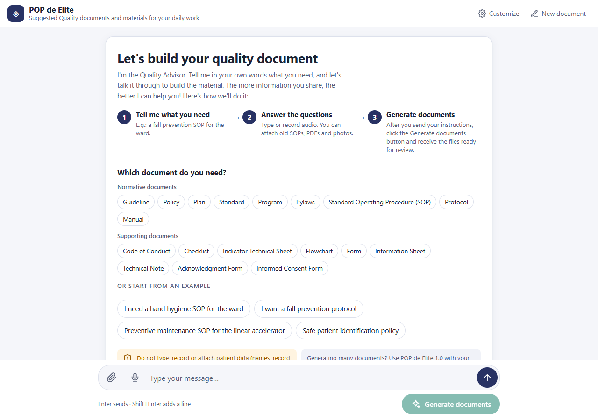

# POP de Elite

> **Drafting aid. Not validated for clinical use.**
> POP de Elite drafts institutional quality documents — standard operating
> procedures, policies, protocols, checklists, consent form templates and others —
> from a conversation. Everything it produces is a **technical draft**: the
> institution's own team must review, adapt and approve it before any use, and the
> signature fields are left blank on purpose. It is not a medical device. It does not
> diagnose, prescribe or decide clinical management, and it does **not accept patient
> data**. See [NOTICE](NOTICE).

<p align="center">
  
</p>

Part of the **[Radioterapia.AI](https://radioterapia.ai)** **web** ecosystem.
It runs inside the Expert area of radioterapia.ai, in the main panel beside the
site's navigation sidebar.

The ecosystem is kept in three deliberately separate layers: **mobile**, the tablet
apps used at the treatment machine; **local**, the tools that run on a Windows
workstation; and **web**, the AI-first agents and the hub — this one. They share a
name and a clinical posture, not a codebase.

---

## The problem it solves

Hospitals and clinics run on written processes, and writing them is slow. A quality
team can spend weeks on one procedure; templates found online describe someone
else's service; and documents written only for an accreditation visit age the day
after it.

POP de Elite helps the team write its **own** documents. A short conversation with
the Quality Advisor collects what the process is, who does each step, what can go
wrong and what is already in place. Then it builds the files, ready for the team to
review.

1. **Pick the document type**, or just describe what you need.
2. **Answer the questions** — type or record audio, and attach old procedures, PDFs
   or photos of current forms. Never patient data.
3. **Generate the documents.** Word always; for the types that use them, an Excel
   management sheet and a PowerPoint training deck.
4. **Review, adapt, approve and sign** — inside the institution.

Already have a document? **Improve and audit a document I already have** asks for it,
audits it in the chat — what is good, what to fix first, what is missing — and then
rebuilds it in the POP de Elite layout, with the original as the main source.

## Document types

| Group | Types | Files |
|---|---|---|
| Normative | Standard operating procedure (POP), policy, protocol, guideline, plan, standard, program, bylaws, manual | Word, Excel, PowerPoint |
| Supporting | Indicator technical sheet | Word, Excel |
| Supporting | Code of conduct | Word, PowerPoint |
| Supporting | Informed consent form (always a template), acknowledgment form, checklist, form, information leaflet, technical note | Word |

Procedures and protocols carry their flowchart as an annex, drawn as a BPMN-style
diagram with one swimlane per role. A standalone flowchart belongs to another
radioterapia.ai engine, MiyAgi Diagram.

**Good practice, not a certifier's manual.** The documents follow general good
practice in quality management and patient safety. No accreditation body's material
was used to build this project, and an accreditation or certification framework is
cited only when the user asks for one — so that the institution keeps its documents
alive between visits, not only for them.

## What is ours, and what is not

**The language model is not ours.** The conversation and the document content are
produced by **Google Gemini**, called by the backend in this repository. Voice is
transcribed by **Groq** (Whisper) through the site's own audio route. The files are
built with **python-docx**, **openpyxl** and **python-pptx**.

What this project builds is everything around the model: the instructions it receives,
the conversation flow, the rules every document must pass before it is built, the
document engine — layout, flowcharts with swimlanes, training slides measured to fit —
and the web interface.

**Not published here:** the knowledge base the model consults on radioterapia.ai, a
quality-management treatise written for this project. The backend works with any
knowledge base in the same format; the tests use a short fictitious one.

Component authorship and licences are in [NOTICE](NOTICE) and
[THIRD_PARTY.md](THIRD_PARTY.md).

## Two regimes, the same code

| | Published code | An institution's own build |
|---|---|---|
| What it is | Teaching and research material | The institution's own tool |
| Medical device? | **No.** Not validated for clinical use | Under the institution's own validation and governance |
| Who answers for it | Whoever downloads, modifies and deploys answers for their own build | The service that deploys it |

The build path is published below: the engine, its API, the 1.0 app and the backend
build and test from this repository alone.

## Privacy

- **No patient data.** The interface warns before every use, photos are reduced and
  stripped of EXIF in the browser, and the instructions forbid transcribing
  identifiable data that appears in an attachment.
- **On radioterapia.ai, the conversation stays in the browser.** History and
  attachments live in the browser's own storage (localStorage and IndexedDB) and are
  erased on logout or when another person signs in on the same browser. The site
  records only a daily token count per user.
- **The engine keeps no document.** Each request is built in a temporary folder
  that is deleted when the request ends, and the engine talks to no AI. When a
  training slide lacks its illustration, it may look up a freely licensed photo on
  Wikimedia Commons or Openverse by a few English keywords — never by document
  content. `POP_SEM_IMAGENS=1` turns that off.
- **Your own key, if you choose.** You can paste your own Google AI Studio key in the
  chat bar. Before it is accepted, a minimal call checks that it works with the site's
  model. It stays in the page's memory only, never in the browser's storage, and is
  gone when you reload, sign out or another person signs in. It travels to the
  radioterapia.ai backend only with the requests that call Google, and is never
  stored or logged. With your key, Google's terms for your account apply: without
  billing, the free tier allows Google to use what you send to improve its products.
- **Logs carry numbers and codes only** — never text, file names, e-mail addresses or
  keys.

## Languages

The interface follows the site's language: Portuguese (Brazil), English, Spanish,
French, German, Italian, Chinese (Simplified), Japanese, Korean, Polish, Arabic and
Bengali. The documents themselves come out in Portuguese, English or Spanish.

## Build your own

You need Python 3.11 or newer and, to regenerate the interface texts, Node.js 22.
The engine measures text with the metrics of Calibri, so it needs **Carlito**
(`fonts-crosextra-carlito` on Debian and Ubuntu) or Calibri itself (present on
Windows). Without either, slides and diagrams are laid out with the wrong widths.

```bash
pip install -r requirements-dev.txt
POP_SEM_IMAGENS=1 python -m pytest -q        # engine, API, 1.0 app and the knowledge-base slicer
node scripts/montar_i18n.mjs --verificar     # interface texts complete in the 12 languages
node scripts/montar_prompts.mjs --verificar  # model instructions in sync with prompts/
node --test tests/backend.test.mjs           # backend, with a simulated Gemini
```

### The engine as an API

```bash
python scripts/montar_space.py               # assembles _montagem/space/
cd _montagem/space
POP_MOTOR_TOKEN=<a long random value> uvicorn app:app --port 7860
```

Or with Docker: `docker build -t pop-motor _montagem/space`, then
`docker run -p 7860:7860 -e POP_MOTOR_TOKEN=<value> pop-motor`.

- `GET /saude` — service status.
- `POST /renderizar` with the header `X-Pop-Token` and
  `{"word": {...}, "excel": {...}, "ppt": {...}, "cor": "#283264", "logo_b64": "...", "estilo": "cientifico"}`
  returns `{"arquivos": [{"formato", "nome", "mime", "tamanho", "base64"}], "erros": {}}`.

The JSON documents in `exemplos/` are valid inputs: procedures, the seven supporting
types, a management sheet and training decks. They are fictitious.

### POP de Elite 1.0

The 1.0 app is the step-by-step path: you paste the JSON that your own Gemini Gems
produce and download the files, built by the same engine. It is also where
radioterapia.ai sends people when the automatic flow fails.

```bash
pip install gradio
python space_v1/app.py
```

### The web interface

`site/pop-de-elite/` is plain HTML, CSS and JavaScript — no framework and no build
step. It talks to the backend at `/api/pop/` (`saude`, `conversa`, `gerar`, `imagens`,
`renderizar`, `chave`, `auditar`). Embedded in radioterapia.ai it uses the site's session; opened
on its own, as the local server below serves it, it needs none. The interface texts
live in `i18n/widget.json`; `node scripts/montar_i18n.mjs` regenerates
`pop-de-elite-i18n.js` from it.

### The backend

`cloudflare/pop/` is a Cloudflare Worker module with no dependencies. It runs the
conversation, calls Gemini, checks every document against the rules in `regras.js`
and hands the result to the engine. Everything that depends on where it runs — sign-in,
the API key, the daily limit, logs — comes from a *host*: `cloudflare/pop/anfitriao.js`
is the standalone one, and its header describes the contract.

The instructions given to the model live in `prompts/` as Markdown (see
[prompts/README.md](prompts/README.md)); `node scripts/montar_prompts.mjs` compiles them.

It also needs a knowledge base: an index and sections that `scripts/fatiar_tratados.py`
builds from Markdown volumes. To try the whole flow on your own computer with the
fictitious one, run the engine as above and then:

```bash
python scripts/fatiar_tratados.py --origem tests/fixtures/tratado --destino site/pop-de-elite/corpus
GEMINI_API_KEY=<your key> POP_MOTOR_URL=http://127.0.0.1:7860 POP_MOTOR_TOKEN=<same value> \
  node scripts/servidor_local.mjs           # then open http://localhost:8788/pop-de-elite/
```

`cloudflare/worker.js` and `cloudflare/wrangler.toml.example` deploy the same backend as a
standalone Worker.

## Project layout

| Folder | What it is |
|---|---|
| `motor/` | The document engine: JSON in, `.docx`, `.xlsx` and `.pptx` out |
| `space/` | The engine as an HTTP API (FastAPI), deployed as a Docker Space on Hugging Face |
| `space_v1/` | POP de Elite 1.0 (Gradio), on the same engine |
| `site/pop-de-elite/` | The web interface embedded in radioterapia.ai |
| `cloudflare/` | The backend (a Cloudflare Worker module) and a standalone Worker |
| `prompts/` | The instructions given to the model |
| `i18n/` | Interface texts in 12 languages |
| `exemplos/` | Fictitious example documents, used by the tests |
| `tests/` | Engine, API, 1.0 and backend tests; `tests/fixtures/` holds a fictitious knowledge base |
| `scripts/` | Assemble the Spaces, regenerate the texts and the instructions, slice a knowledge base, run the backend locally, build sample documents |

## Reporting a problem

Open an issue. **Do not include patient data** — the form asks you to confirm it
before it can be sent. A document that comes out clinically wrong is a correctness
bug and is welcome as an issue.

## Security

See [SECURITY.md](SECURITY.md). Please do not report vulnerabilities in public
issues.

## How to cite

See [CITATION.cff](CITATION.cff), or use GitHub's *Cite this repository* button.

## Licence and name

The code is licensed under the [Apache License 2.0](LICENSE). The names
*POP de Elite* and *Radioterapia.AI* are not covered by it — see
[TRADEMARK.md](TRADEMARK.md).
